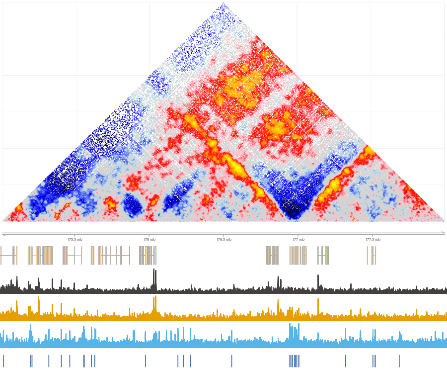
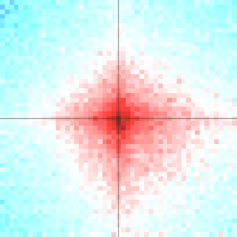

Shaman package impelements functions for resampling Hi-C matrices in order to generate expected contact distributions given constraints on marginal coverage and contact-distance probability distributions. The package also provides support for visualizing normalized matrices and statistical analysis of contact distributions around selected landmarks. It is an R package embedding algorithms implemened in C++, which is built over support from the Tanay's lab *Misha* genomic database system that is provided with the package.


The normalization workflow consists of the following steps:

1. [Import](https://tanaylab.bitbucket.io/shaman/articles/import.html) observed HiC data to misha db. In order to utilize full functionality of the shaman package, you need to construct a Misha database for your genome of interest, and import your Hi-C data to Misha binary Quad-tree format.
2. Shuffle observed data to generate expected data. Reshuffling of an entire dataset will require 7 hours per 1 billion reads on a machine with one core per chromosome. Note that shaman can also run distributed using Sun Grid Engine.
3. Compute the normalized score of each observed data point. This computation can be conducted inline for a specific genomic region, or pre-processed on the entire dataset using distributed computation. Score computation on 1 billion reads on a distributed system may take 4-10 hours, depending on the number of cores available.
4. Visualize normalized contact maps. Precomputed normalized scores allow for flexible analysis of contact distributions.
5. Quantify contact enrichment acoording to genomic features.

In the example misha database provided in this package we have created a low-footprint matrix to examplify the shaman workflow. We included 4.6 million contacts from ELA K562 dataset covering the hoxd locus (chr2:175e06-178e06) and convergent CTCF regions. Processing the complete matrix from this study require downloading the full contact list and regenerating the reshuffled matrix.

## Workflow
Once an observed HiC dataset is available in the misha db (refere to  [Import](https://tanaylab.bitbucket.io/shaman/articles/import.html)) for additional information), there are two possible modes to continue analysis:
1. Distributed computation - relying on sun grid engine (sge), or using a single machine with multi-cores.
2. Local computation - for computing normalized matrices in small genomic regions

### Distributed mode 
- Set configuration parameter "shaman.sge_support" for sge or "shaman.mc_support" for multi-core to 1.
```{r, eval=FALSE, warning=FALSE}
options(shaman.mc_support=1)
```
- Generate expected HiC misha 2D track
```{r, eval=FALSE, warning=FALSE}
shaman_shuffle_hic_track(track_db=shaman_get_test_track_db(), obs_track_nm="hic_obs", work_dir=tempdir())
```
- Generate score 2D track 
```{r, eval=FALSE, warning=FALSE}
shaman_score_hic_track(track_db=shaman_get_test_track_db(), work_dir=tempdir(), score_track_nm="hic_score_new", obs_track_nms="hic_obs")
```
- Visualize region
```{r, eval=FALSE, warning=FALSE}
gsetroot(shaman_get_test_track_db())
point_score = gextract("hic_score", gintervals.2d(2, 175e06, 178e06, 2, 175e06, 178e06), colnames="score")
shaman_plot_map_score_with_annotations("hg19", point_score, gintervals(2, 175e06, 178e06), misha_tracks=list("K562.k27ac", "rna-seq"), annotations=list("ctcf_forward", "ctcf_reverse"), a_colors=c("#4572A7", "#AA4643"))
```


### Local mode
- Generating an expected matrix and computing its score for a given interval: a local computation is possible on a small region:
```{r, eval=FALSE, warning=FALSE}
point_score = shaman_shuffle_and_score_hic_mat(obs_track_nms="obs", interval=interval, work_dir="work_dir")
```
- Visualize region
```{r, eval=FALSE, warning=FALSE}
shaman_plot_map_score_with_annotations("hg19", point_score$points, region, misha_tracks=list("K56.k27ac", "rna-seq"), annotations=list("ctcf_pos", "ctcf_neg"), a_colors=c("#4572A7", "#AA4643"))
```
## Analysis
### Spatial contact enrichment - used to measure contact enrichemnt between two sets of genomic features.
Relies on an existance of an expected (shuffled) 2d track.
Builds a grid comprising of all combinations of intervals from feature 1 and feature 2 that fall within a band 
defined by min_dist and max_dist. For each point on the grid, look at th surrounding window, defined by range parameter. 
Discard all windows that do not contain a point with a score (defined in scotre_track_nm) above the score_filter parameter.
This allows for focusing on potentially enriched pairs. Discect the window into small bins, size in base pairs defined by 
the resolution parameter, and count the number of observed contacts, and the number of expected contacts in each bin.
All windows are then summed together, generating a single matrix of observed and expected contacts, which is returned by function.
Note that grid contains only points in which feature 1 position is smaller than feature 2 position.

Create data grid for two sets of features, and visualize it:
```{r, eval=FALSE, warning=FALSE}
grid = shaman_generate_feature_grid(feature1, feature2, obs_track, exp_track, range=25000, resolution=500)
shaman_plot_feature_grid(grid, range=25000, grid_resolution=500, plot_resolution=1000)
```



### Options
The following options are available for this package:

#### System parameters

* shaman.mc_support = 0 - Set to 1 if multi-core is available for distributed computing.
* shaman.sge_support = 0 - Set to 1 if Sun Grid Engine is available for distributed computing.
* shaman.sge_flags = ""  - SGE paramters to be passed to qsub (e.g. threads, queue, etc').
Note that for some shaman package methods either muli-core or sge support is required.

#### Visualization parameters

* shaman.score_pal_0_col = 'lightgrey' - the color to display zero score points, points that are not enriched or depleted in contacts
* shaman.score_pal_pos_col = c('lightgrey', 'pink', 'red', 'orange', 'yellow') - the color palette to use for contact enrichment (from low to high)
* shaman.score_pal_neg_col = c('lightgrey', 'lightblue', 'blue', 'black') - the color palette to use for contact depletion (from low to high)
